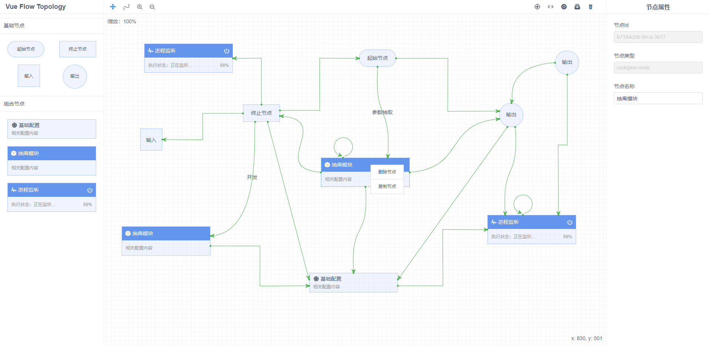

# vue-flow-topology
## 介绍
> vue-flow-topology 该项目可以看做是一个独立的 Vue 项目（大数据流水线拓展流程工作台），也可以嵌入到其他vue项目中使用，新版会作为优先版本持续迭代。
- 版本一：基于 `Vue-cli3.0` + `view-design` + `JSPlumb` 开发（ `master` 分支 ）。
- 版本二：基于 `Vue-cli3.0` + `Ant Design Vue` + `JSPlumb` 开发（ `simple` 分支 ）。

## 特性
✅ 支持画布重绘、拖拽、放大、缩小功能

✅ 支持鼠标滚轮缩放画布功能

✅ 支持拖拽、添加、删除节点功能

✅ 支持不同连线类型进行关联节点功能

✅ 支持删除连线、重绘连线功能

✅ 支持点击画布设置属性功能

✅ 支持点击节点设置属性功能

✅ 支持点击线进行设置属性功能

✅ 支持导入、导出指定数据文件功能

✅ 支持复制、粘贴节点功能

## 版本一（ master 分支 ）
### 演示地址
- → 在线 Demo 预览：[http://flow.zhenglinglu.cn](http://flow.zhenglinglu.cn)
### 快速使用
```bash
# clone this project
git clone https://github.com/zlluGitHub/vue-flow-topology.git

# Project setup
npm install

# Compiles and hot-reloads for development
npm run dev

# Compiles and minifies for production
npm run build

# Lints and fixes files
npm run lint
```
#### 示例图片


## 版本二（ simple 分支 ）
### 演示地址
- → 在线 Demo 预览：[http://flow.zhenglinglu.cn/simple.html](http://flow.zhenglinglu.cn/simple.html)
### 快速使用
```bash
# clone this project
git clone -b simple https://github.com/zlluGitHub/vue-flow-topology.git

# Project setup
npm install

# Compiles and hot-reloads for development
npm run dev

# Compiles and minifies for production
npm run build

# Lints and fixes files
npm run lint
```
#### 示例图片
