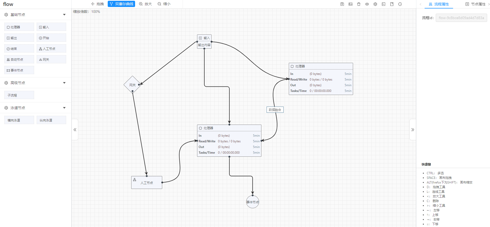

# vue-flow-topology
> vue-flow-topology 是基于 Vue-cli3.0 + Ant Design Vue + JSPlumb 开发的一个大数据流水线拓展流程工作台，该项目可以看做是一个独立的 Vue 项目，也可以嵌入到其他vue项目中使用，新版会作为优先版本持续迭代。
## 在线预览
- → [在线 Demo](http://flow.zhenglinglu.cn/)
## 快速使用

### clone this project
```bash
git clone https://github.com/zlluGitHub/vue-flow-topology.git
```
### Project setup
```bash
npm install
```
### Compiles and hot-reloads for development
```bash
npm run dev
```
### Compiles and minifies for production
```bash
npm run build
```
### Lints and fixes files
```bash
npm run lint
```
## 示例图片
